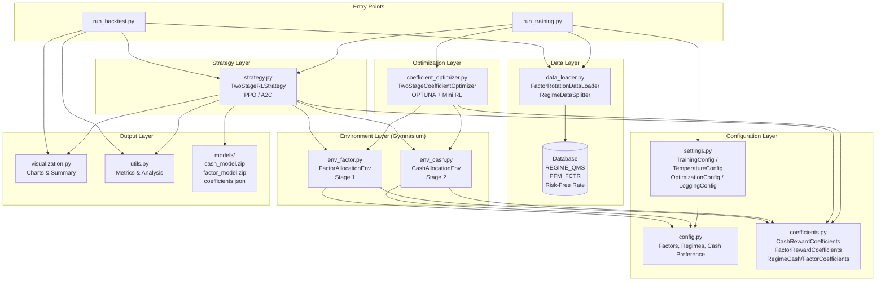
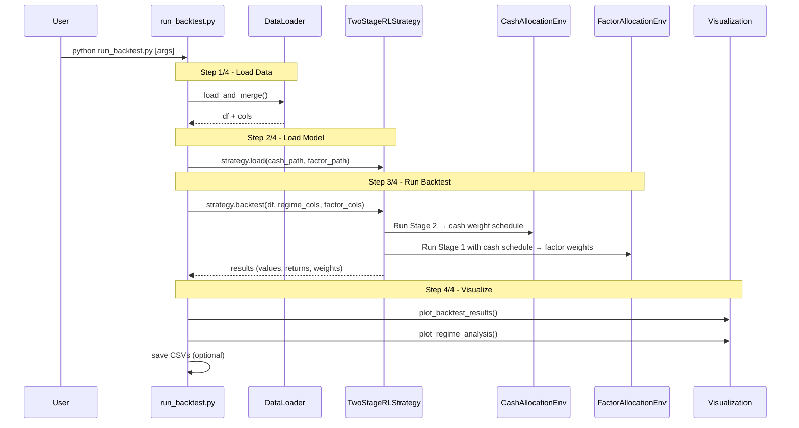
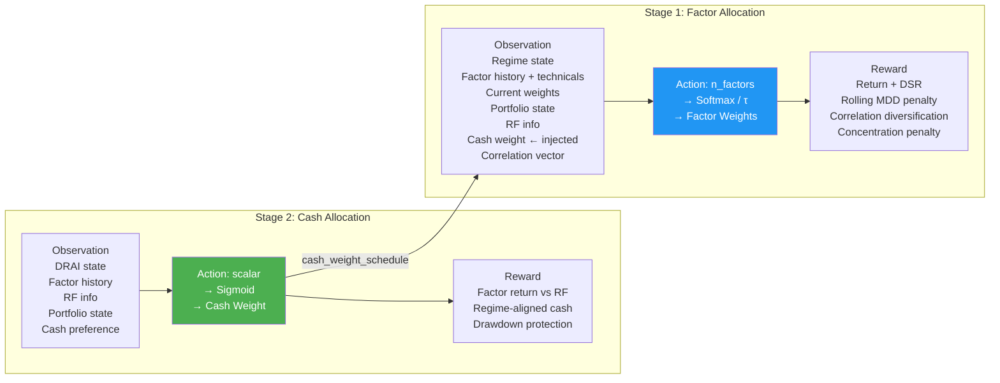

# ML6: RL Factor Rotation (2-Stage Model)

**Version:** 6.2.0
**Author:** Truston Quant Team

A reinforcement learning-based factor rotation strategy that uses a **two-stage architecture** to separately optimize **factor weights** (Stage 1) and **cash allocation** (Stage 2). The ML6 version simplifies regime classification to use **DRAI (Dynamic Risk Appetite Index) only**, excluding GROWTH and INFLATION signals from the cash allocation decision.

---

## How It Works

The system trains two independent RL agents (PPO or A2C via Stable Baselines3) that cooperate through schedule passing:

1. **Stage 2 (Cash Model)** trains first, learning optimal cash-vs-factor allocation using DRAI regime signals and factor return vs. risk-free rate comparison.
2. The trained Cash Model generates a **cash weight schedule** across all training timesteps.
3. **Stage 1 (Factor Model)** trains second, receiving the cash schedule as a fixed input and learning how to distribute weights across 6 factors using correlation-based diversification rewards.
4. At inference/backtest time, Stage 2 runs first to produce cash weights, then Stage 1 runs with those weights injected.

Optionally, an **OPTUNA-based coefficient optimizer** tunes the reward function hyperparameters for each regime before full training begins.

---

## Code Structure

```
ML6/
├── run_training.py                  # Entry point: training pipeline (5 steps)
├── run_backtest.py                  # Entry point: backtest & visualization
└── rl_factor_rotation/             # Core package
    ├── __init__.py                  # Public API exports (v6.2.0)
    ├── settings.py                  # Global config (dataclasses): training, temperature, optimization, logging
    ├── config.py                    # Constants: factors, regimes, cash preference functions
    ├── data_loader.py               # DB data loading: regime, factor returns, risk-free rate
    ├── coefficients.py              # Reward coefficient dataclasses & per-regime storage
    ├── env_factor.py                # Gymnasium env: Stage 1 (factor weight allocation)
    ├── env_cash.py                  # Gymnasium env: Stage 2 (cash weight allocation)
    ├── strategy.py                  # TwoStageRLStrategy: learn, backtest, predict, save/load
    ├── coefficient_optimizer.py     # OPTUNA + mini-RL coefficient tuning (2-stage)
    ├── utils.py                     # Performance metrics, turnover, regime analysis
    └── visualization.py             # Matplotlib charts & performance summary
```

---

## Architecture Diagram



---

## Training Data Flow

```mermaid
sequenceDiagram
    participant User
    participant RT as run_training.py
    participant DL as DataLoader
    participant DB as Database
    participant OPT as CoefficientOptimizer
    participant STRAT as TwoStageRLStrategy
    participant EC as CashAllocationEnv
    participant EF as FactorAllocationEnv

    User->>RT: python run_training.py [args]
    RT->>RT: parse_args() & update_settings()

    Note over RT,DB: Step 1/5 - Load Data
    RT->>DL: load_and_merge(start_date, end_date)
    DL->>DB: SQL: factor returns (PFM_FCTR)
    DL->>DB: SQL: regime states (REGIME_QMS)
    DL->>DB: risk-free rate
    DL-->>RT: df_merged + column names

    Note over RT,DB: Step 2/5 - Load Correlations
    RT->>DB: get_regime_correlation_matrices (from ML3)
    DB-->>RT: correlation_matrices (per regime)

    Note over RT,OPT: Step 3/5 - Optimize Coefficients (optional)
    RT->>OPT: quick_two_stage_optimize(train_df)
    OPT->>OPT: OPTUNA trials x3 rounds (1/4 → 1/2 → full)
    OPT->>EC: mini RL training per trial (cash)
    OPT->>EF: mini RL training per trial (factor)
    OPT-->>RT: optimized cash_coef, factor_coef

    Note over RT,EF: Step 4/5 - Two-Stage Training
    RT->>STRAT: strategy.learn(df, timesteps, correlations)
    STRAT->>EC: Train Cash Model (Stage 2 first)
    EC-->>STRAT: trained cash_model
    STRAT->>STRAT: generate cash_weight_schedule
    STRAT->>EF: Train Factor Model (Stage 1) with cash schedule
    EF-->>STRAT: trained factor_model
    STRAT->>STRAT: backtest on test data
    STRAT-->>RT: results

    Note over RT: Step 5/5 - Save
    RT->>RT: save models + coefficients
    RT->>RT: print_performance_summary
```

---

## Backtest Data Flow



---

## Two-Stage RL Architecture



---

## Key Components

### 6 Factors

| Code | Factor |
|------|--------|
| CP_V | Value |
| CP_G | Growth |
| CP_Q | Quality |
| CP_MOM | Momentum |
| CP_LV | Low Volatility |
| CP_S | Size |

### 3 DRAI Regimes (ML6 simplification)

| State | Regime | Cash Preference |
|-------|--------|-----------------|
| +1 | DRAI Risk-On | Low cash (aggressive) |
| 0 | DRAI Neutral | Moderate cash |
| -1 | DRAI Risk-Off | High cash (defensive) |

### Reward Functions

**Stage 2 (Cash) - Key signals:**
- Excess return direction: factor return > RF → reward low cash; factor return < RF → reward high cash
- RF interest rate level adjustments
- Drawdown protection bonus
- Weight change smoothing penalty

**Stage 1 (Factor) - Key signals:**
- Portfolio return (weighted by coefficient)
- Differential Sharpe Ratio (DSR) via EMA
- Rolling MDD penalty
- Correlation-based diversification: penalizes joint high weights on positively correlated factors; rewards balanced allocation across negatively correlated factors

---

## Coefficient Optimization (OPTUNA)

The optimizer runs **3 progressive rounds** with increasing trial counts (`n_trials/4 → n_trials/2 → n_trials`) to efficiently search the reward coefficient space. Each trial:

1. Samples coefficient values via TPE (Tree-structured Parzen Estimator)
2. Trains a **mini RL model** (short timesteps) with those coefficients
3. Evaluates Sharpe ratio as the objective
4. Best coefficients are saved per regime

---

## Usage

### Training

```bash
python run_training.py \
    --start-date 2000-10-27 \
    --end-date 2025-12-19 \
    --algorithm PPO \
    --cash-timesteps 500000 \
    --factor-timesteps 500000 \
    --temperature 0.5 \
    --optimize-coef \
    --optuna-trials 40
```

### Backtest

```bash
python run_backtest.py \
    --start-date 2000-10-27 \
    --end-date 2025-12-19 \
    --test-only \
    --save-plots
```

### Key Arguments

| Argument | Default | Description |
|----------|---------|-------------|
| `--algorithm` | PPO | RL algorithm (PPO or A2C) |
| `--cash-timesteps` | 500,000 | Training steps for cash model |
| `--factor-timesteps` | 500,000 | Training steps for factor model |
| `--temperature` | 0.5 | Softmax temperature for factor weights |
| `--optimize-coef` | True | Enable OPTUNA coefficient optimization |
| `--optuna-trials` | 40 | Number of OPTUNA trials per regime |
| `--train-ratio` | 0.8 | Train/test split ratio |
| `--rf-source` | TB3Y | Risk-free rate source (3Y Treasury) |

---

## File Sequence (Training Pipeline)

| Step | File(s) Used | Purpose |
|------|-------------|---------|
| 1 | `settings.py` → `config.py` | Load configuration and constants |
| 2 | `data_loader.py` | Fetch regime, factor, RF data from DB |
| 3 | `coefficient_optimizer.py` → `coefficients.py` | OPTUNA + mini RL coefficient tuning |
| 4 | `strategy.py` → `env_cash.py` → `env_factor.py` | Two-stage RL training |
| 5 | `strategy.py` → `utils.py` → `visualization.py` | Evaluation, save, summary |

---

## Output Files

| File | Description |
|------|-------------|
| `models/cash_model.zip` | Trained Stage 2 (cash allocation) PPO/A2C model |
| `models/factor_model.zip` | Trained Stage 1 (factor allocation) PPO/A2C model |
| `models/coefficients.json` | Default reward coefficients |
| `models/optimized_coefficients.json` | OPTUNA-optimized reward coefficients |
| `results/backtest_results.png` | Portfolio value, cash/factor weight charts |
| `results/regime_analysis.png` | Regime-level performance analysis |
| `results/portfolio_values.csv` | Time series of portfolio value |
| `results/weights_history.csv` | Time series of all weight allocations |

---

## Dependencies

- Python 3.8+
- `stable-baselines3` (PPO, A2C)
- `gymnasium`
- `optuna`
- `numpy`, `pandas`
- `matplotlib`
- Internal: `util.database2` (Truston DB connector)
